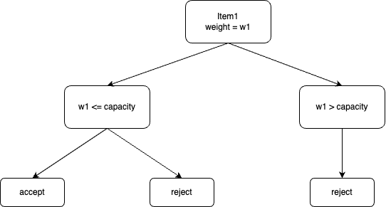

## Steps to solve any Recursion problems
1. Write the base condition
2. Create a choice diagram
3. Write the code with the help of base condition and choice diagram

### Writing the Base Condition
1. Think of the smallest valid input and the output for the same.
   For example, to solve a knapsack problem to maximize profit, a function would take the weights, values, and the maximum capacity of the knapsack. The smallest valid case would be when there are no weights or values provided, the profit would be 0.

    ```python3
    if len(weigths) == 0 or capacity == 0:
        return 0
    ```

### Create a choice Diagram
<div style="text-align: center;">
    
</div>


### Write the code with the help of base condition and choice diagram